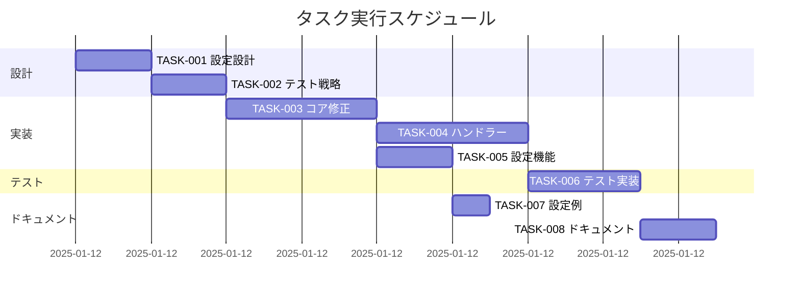

# スラッシュコマンドフォールバック機能 実装タスク

## 概要

push-tmux で未定義の `/` から始まるコマンド（例: `/login`）を通常のメッセージとして送信できるようにする修正。
これにより、claude-code などの外部ツールのスラッシュコマンドも正しく処理される。

**全タスク数**: 8  
**推定作業時間**: 4時間  
**クリティカルパス**: TASK-001 → TASK-002 → TASK-003 → TASK-004 → TASK-005

## 問題の現状

現在の実装では:
- `/` で始まるメッセージはすべてスラッシュコマンドとして扱われる
- 未定義のコマンドは単に無視される（メッセージが捨てられる）
- `/login` のような他ツールのコマンドが機能しない

## タスク一覧

### フェーズ1: 設計と準備

#### TASK-001: 設定スキーマの設計

- [x] **タスク完了**
- **タスクタイプ**: DIRECT
- **依存タスク**: なし
- **実装詳細**:
  - 新しい設定項目 `slash_commands_settings` の定義
  - `fallback_undefined` オプションの仕様策定
  - デフォルト値の決定（`true` を推奨）
- **完了条件**:
  - [x] 設定スキーマが明確に定義されている
  - [x] 後方互換性が保証されている

#### TASK-002: テスト戦略の策定

- [x] **タスク完了**
- **タスクタイプ**: DIRECT
- **依存タスク**: TASK-001
- **実装詳細**:
  - 既存テストへの影響評価
  - 新規テストケースの設計
  - エッジケースの洗い出し
- **テスト要件**:
  - [x] 未定義コマンドのフォールバック動作
  - [x] 定義済みコマンドの継続動作
  - [x] 設定による動作切り替え

### フェーズ2: コア実装

#### TASK-003: slash_commands.py の修正

- [x] **タスク完了**
- **タスクタイプ**: TDD
- **依存タスク**: TASK-002
- **実装詳細**:
  - `expand_slash_command` 関数の拡張
  - 設定による分岐ロジックの追加
  - 戻り値に `fallback_to_normal` フラグを追加
- **変更内容**:
  ```python
  # 戻り値を拡張
  # (is_slash_command, expanded_command, target_session, should_fallback)
  ```
- **テスト要件**:
  - [x] 単体テスト: 設定有効時の動作
  - [x] 単体テスト: 設定無効時の動作
  - [x] 単体テスト: エッジケース

#### TASK-004: listen.py ハンドラーの修正

- [x] **タスク完了**
- **タスクタイプ**: TDD
- **依存タスク**: TASK-003
- **実装詳細**:
  - `_create_auto_routing_handler` の修正
  - `_create_specific_device_handler` の修正
  - フォールバック時の処理追加
- **変更箇所**:
  - 行108-118: スラッシュコマンド処理ロジック
  - 行162-172: デバイス固有ハンドラー
- **テスト要件**:
  - [x] 統合テスト: フォールバック動作
  - [x] 統合テスト: 通常コマンド動作
  - [x] モックテスト: tmux送信確認

#### TASK-005: 設定ロード機能の実装

- [x] **タスク完了**
- **タスクタイプ**: TDD
- **依存タスク**: TASK-003
- **実装詳細**:
  - config.py での新設定項目サポート
  - デフォルト値の設定
  - 設定ファイルからの読み込み
- **テスト要件**:
  - [x] 設定ファイル有無での動作
  - [x] 不正な設定値のハンドリング

### フェーズ3: テストとドキュメント

#### TASK-006: テストケースの実装

- [x] **タスク完了**
- **タスクタイプ**: TDD
- **依存タスク**: TASK-004, TASK-005
- **実装詳細**:
  - test_slash_commands.py への新規テスト追加
  - test_device_targeting.py の修正
  - E2Eテストケースの追加
- **テストケース**:
  - [x] `/login` が通常メッセージとして送信される
  - [x] `/unknown-cmd` がフォールバックされる
  - [x] 定義済みコマンドは従来通り動作
  - [x] 設定無効時は従来動作を維持

#### TASK-007: サンプル設定ファイルの更新

- [x] **タスク完了**
- **タスクタイプ**: DIRECT
- **依存タスク**: TASK-005
- **実装詳細**:
  - examples/config_slash_commands.toml の更新
  - 新設定項目の追加と説明
  - 使用例の追加
- **完了条件**:
  - [x] 設定例が明確
  - [x] コメントで動作説明

#### TASK-008: ドキュメントの更新

- [x] **タスク完了**
- **タスクタイプ**: DIRECT
- **依存タスク**: TASK-006
- **実装詳細**:
  - README.md への機能説明追加
  - CLAUDE.md の更新
  - slash_command_usage.md の更新
- **ドキュメント項目**:
  - [x] 新機能の説明
  - [x] 設定方法
  - [x] 動作例
  - [x] 移行ガイド

## 実行順序



## 実装詳細

### 設定ファイル例

```toml
# config.toml
[slash_commands_settings]
# 未定義のスラッシュコマンドを通常メッセージとして送信
fallback_undefined = true  # デフォルト: false

# オプション: 特定のプレフィックスのみカスタムコマンドとして扱う
# custom_prefix = "pt-"  # 例: /pt-deploy のみカスタム
```

### コード変更例

```python
# slash_commands.py の修正
def expand_slash_command(message: str, config: Dict[str, Any], device_name: str) -> Tuple[bool, Optional[str], Optional[str], bool]:
    """
    Returns:
        (is_slash_command, expanded_command, target_session, should_fallback)
    """
    settings = config.get('slash_commands_settings', {})
    fallback_undefined = settings.get('fallback_undefined', False)
    
    parser = SlashCommandParser(config)
    command, arguments = parser.parse_message(message)
    
    if not command:
        return False, None, None, False
    
    # コマンドが定義されていない場合
    if command not in parser.commands:
        if fallback_undefined:
            # 通常メッセージとして処理
            return False, None, None, True
        else:
            # 従来動作：エラーメッセージ
            click.echo(f"Unknown command: /{command}")
            return True, None, None, False
    
    # 以下、既存の処理...
```

## リスクと対策

1. **後方互換性**
   - リスク: 既存の動作に依存するユーザーへの影響
   - 対策: デフォルトを `false` にして opt-in 方式にする

2. **セキュリティ**
   - リスク: 意図しないコマンドの実行
   - 対策: フォールバック時も tmux へ送信するだけで、直接実行はしない

3. **パフォーマンス**
   - リスク: 追加の条件分岐による処理速度低下
   - 対策: 最小限の変更で実装、早期リターンを活用

## 完了条件

- [x] すべてのテストが通過
- [x] ドキュメントが更新済み
- [x] `/login` などの外部コマンドが正しく送信される
- [x] 既存のカスタムコマンドが正常動作
- [x] 設定による動作切り替えが機能する